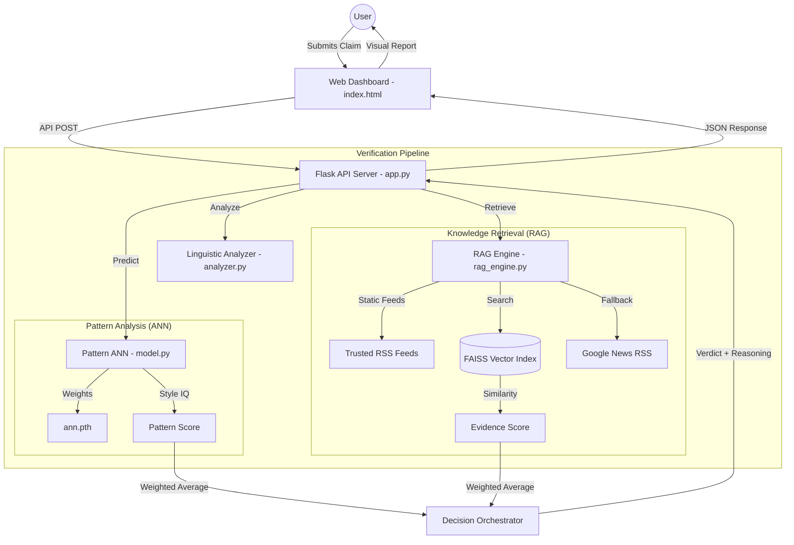

# TruthLens v9.0 — System Architecture

## Component Breakdown

### 1. Web Dashboard (`index.html`)
- Professional, dark-mode interface.
- Real-time status polling (`/api/status`).
- Dynamic evidence rendering with source favicons and similarity bars.

### 2. Flask API (`app.py`)
- Manages request/response lifecycle.
- Handles background thread initialization for ML models.
- Provides `/api/predict` and `/api/refresh` endpoints.

### 3. Linguistic Analyzer (`analyzer.py`)
- **Topic Detection**: Categorizes into Sports, Weather, Politics, etc.
- **Location Detection**: Specifically optimized for Hyderabad and Telangana.
- **Sentiment & Style**: Detects sensationalism and attribution patterns.

### 4. ANN Model (`model.py` & `train.py`)
- 5-layer Deep Neural Network.
- Trained on the WELFake dataset (35,000+ samples).
- Detects the "fingerprint" of fake news writing (metadata and grammar).

### 5. RAG Engine (`rag_engine.py`)
- **Indexing**: Consumes RSS feeds to create a local semantic knowledge base.
- **Semantic Search**: Uses FAISS for high-speed cosine similarity matching.
- **Live Fallback**: Dynamically scrapes Google News if the local index doesn't have relevant recent data.
